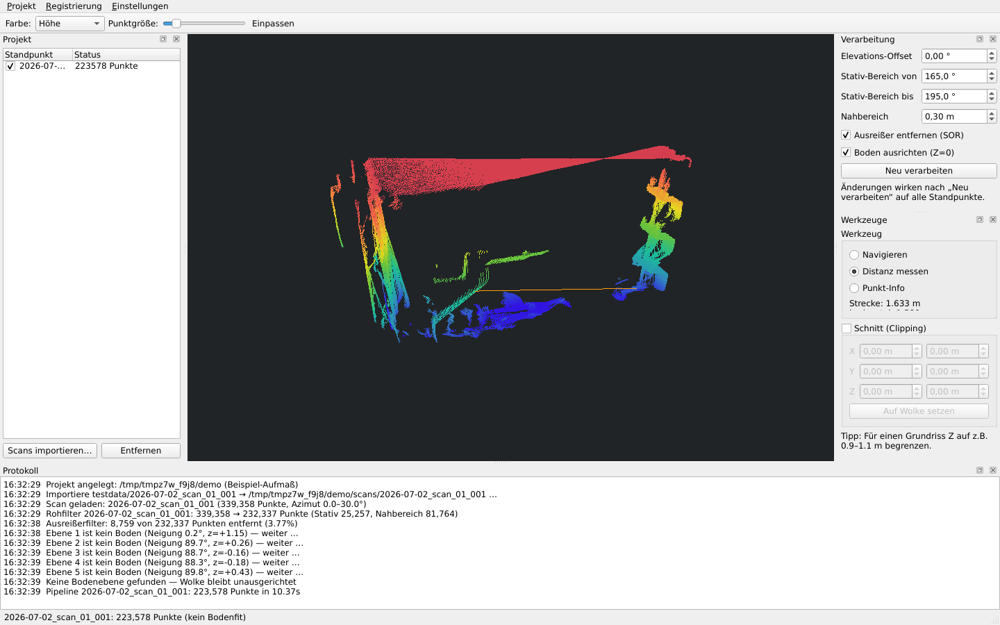

# Scanorama Studio

*English — deutsche Version: [README.de.md](README.de.md)*

Desktop application (Windows-first, Python + Qt) that processes the raw
data recorded by the [scanorama](https://github.com/ferengi82/scanorama)
3D LiDAR scanner: import scan folders (from disk or via SSH from the
Raspberry Pi), compute and filter point clouds, register and fuse
multiple stations, inspect and measure in the built-in 3D viewer, and
export to E57 / PLY / LAS.



## Features (v1)

- **Projects**: one project = one survey; stations, settings, poses and
  results live in a project folder (`project.json`), fully reproducible
- **Processing pipeline**: raw scan → tripod/close-range filters →
  polar→cartesian (with elevation-offset calibration) → statistical
  outlier removal → automatic floor alignment (Z=0)
- **3D viewer** (OpenGL): millions of points, LOD while navigating,
  coloring by intensity / height / station
- **Tools**: distance measurement (3D/horizontal/height difference),
  clipping box (floor-plan sections), point info
- **Registration & fusion**: FPFH+RANSAC → multi-scale ICP → pose graph,
  distance-weighted voxel fusion (STL27L error model), quality rating
  per pair
- **Exports**: E57 (single or multi-station with poses — imports into
  Metashape as registered scan stations), PLY, LAS/LAZ
- **Device transfer**: list and download scans from the Pi over SSH
- UI in German and English (Settings → Language)

## Installation

**Windows (recommended):** download `ScanoramaStudio-windows.zip` from
the [releases](https://github.com/ferengi82/scanorama-desktop/releases),
unzip, run `ScanoramaStudio.exe`.

**From source (Windows/Linux):**

```bash
git clone https://github.com/ferengi82/scanorama-desktop.git
cd scanorama-desktop
python -m venv venv
./venv/bin/pip install -e .          # Windows: venv\Scripts\pip install -e .
./venv/bin/scanorama-studio          # GUI
```

## Typical workflow

1. **Project → New project…** — choose a folder for the survey
2. **Project → Import scans…** (from a USB stick / folder) or
   **Fetch scans from device…** (SSH from the Pi)
3. Select a station → it is processed and displayed; adjust parameters
   in the *Processing* panel and hit *Reprocess* if needed
4. **Registration → Register & fuse stations** (Ctrl+R) — poses are
   computed and stored, the merged cloud is shown colored by station
5. Export: merged cloud (E57/PLY/LAS) or *All stations as E57 with
   poses* for Metashape

## Headless batch processing

```bash
scanorama-studio-cli process ~/scans/2026-07-02_scan_01_003 \
    --out ./output --formats e57 ply las
```

## Repository layout

```
studio/core/        processing (no Qt): rawscan, transform, filters,
                    floor, registration, fusion, export, project, transfer
studio/ui/          PySide6: main window, panels, tools, GL viewer, i18n
studio/cli.py       headless batch pipeline
tests/              pytest (~70 tests, no hardware required)
scanorama-studio.spec  PyInstaller build (Windows EXE via GitHub Actions)
docs/dev/           decisions, plan, roadmap, status (working docs)
```

The raw data format is defined once, in the
[scanner repository](https://github.com/ferengi82/scanorama/blob/main/docs/DATAFORMAT.md) —
Studio uses the scanner package as a dependency for decoding.

## License

MIT — see [LICENSE](LICENSE).
